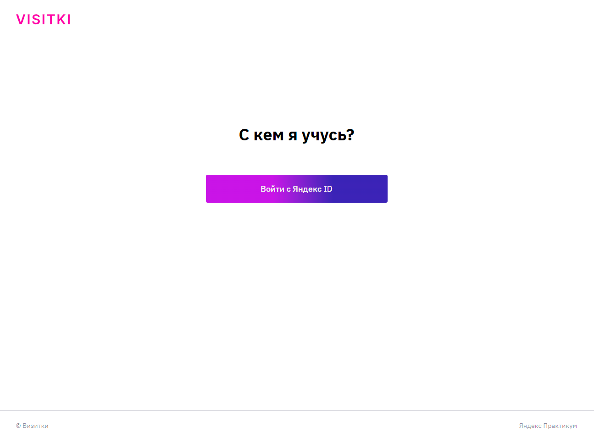
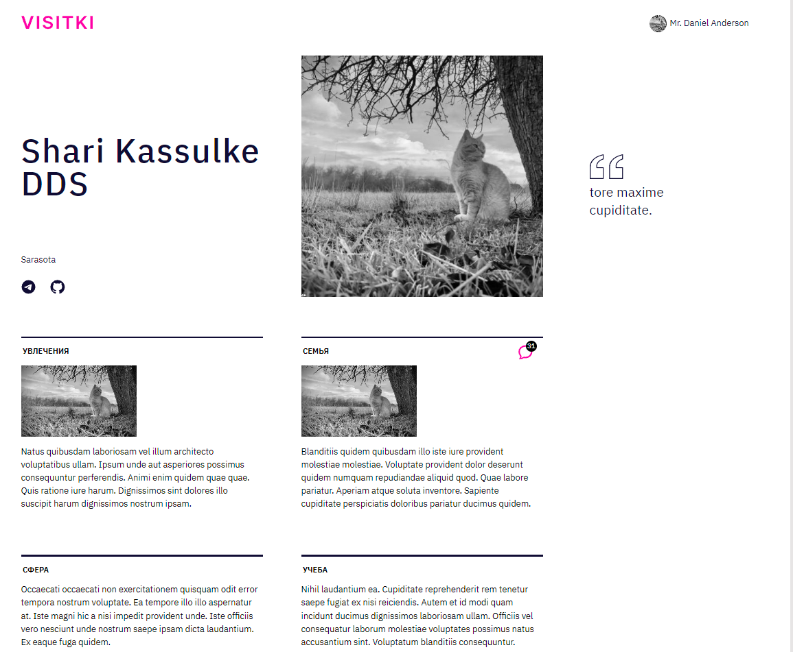
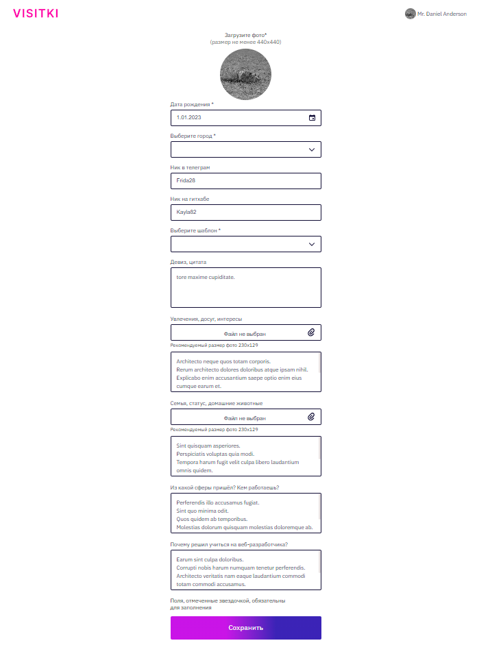

### Проект платформы-визитницы VISITKI

## Авторы: команда №7, в составе: 
1. [Александра Гончарова](https://github.com/EukleidesRUS/)
2. [Андрея Чебанова](https://github.com/Feelcover)

___
### О проекте
*Данный проект реализован в рамках обучения в Яндекс.Практикум.
*Цель проектного месяца: Реализовать данный проект, согласно технического задания реального заказчика.

Visitki - своеобразная внутренняя социальная сеть для студентов Яндекс.Практикум. Проект содержит личные страницы студентов, кураторов и наставников. Платформа позволяет учащимся лучше узнать друг друга, так как каждый пользователь может указать:
* Любимую цитату
* Местоположение
* Интересы, хобби, сферу работы и многое другое!
У студентов так же есть возможность оставлять комментарии под каждой "визиткой".

№Основная функциональность
1. Заполнение собственной визитки.
2. Просмотр всех визиток когорты.
3. Просмотр детальной версии визитки.
4. Комментирование (или реакция эмоджи) визитки целиком или отдельных её блоков.
5. Просмотр комментариев (реакций) на свою визитку (недоступно другим студентам).
6. Пост-модерация реакций (для кураторов).

___
## Использованные технологии
* HTML
* CSS
* Адаптивная, кроссбраузерная верстка с использованием Flexbox и Grid Layout
* Авторизация с помощью Яндекс ID 
* Работа с картами и подсказками городов при помощи API Яндекс.Карт 
* React - JSX (модульный подход с использованием import, export)
* Hooks
* Redux
* Ref
* React Router v6.7
* TypeScript
* Установка заготовенного CRA - npx create-react-app react-burger --template typescript 
* Организована файловая структура: 
  - Каждый компонент хранится в отдельной директории
  - Для стилизации компонентов используются CSS-модули
  - Директории и файлы компонентов в нотации CamelCase

___
## Макет

[Ссылка на макет проекта](https://www.figma.com/file/nKBudPP12bvNm15W486Y9R/WEB_RUS_STUD_soft_skills?t=bKfp4S1GRIKJ6k4g-6)

___
## Локальная установка и запуск
```
Клонировать репозиторий
  git clone https://github.com/EukleidesRUS/Visitki.git

Войти в проект через консоль
  cd Visitki

Установить зависимости
  npm install

Старт сервера
  npm start
```

___
### Страница авторизации
* Пользователь авторизуется через Яндекс ID



___
### Главная страница
* Главная страница для студента с отображением его однокурсников, так же к данной странице каждой из групп имеет доступ администратор.
На главной странице студент видит краткие версии визиток всей когорты. Все фотографии отображаются в черно-белом режиме.

1. С главной страницы студент может перейти:
    - на страницу выбранной визитки с детальной информацией;
    - на карту, где отмечено расположение других студентов.
2. На главной странице есть выпадающее меню, которое позволяет отфильтровать студентов по выбранному городу.
3. Если навести мышь на визитку, в правом верхнем углу появится значок комментирования, по нажатию на который появляется плашка с полем для ввода текстового комментария или выбора реакции-эмоджи. В версиях для планшета и мобильного телефона значок виден всегда.
4. Для владельца визитки и куратора поверх значка комментирования отображается количество реакций на визитку, а нажатие на значок открывает плашку с самими комментариями.

Информацию о том, визитки какой когорты показывать на главной страницы, нужно брать из данных сессии авторизованного студента.

Для куратора когорта не задана, поэтому его нужно переадресовывать на главную админки (модерация комментариев). Но куратор может заходить на страницу любой когорты по адресу `/cohort/{name}` по ссылкам из админки. Для студента страницы когорт, кроме собственной, недоступны.


___
### Страница детальной информации профиля
У каждого пользователя в своем профиле можно выбрать, в каком стиле будет отображаться его визитка: “серьезный”, “дерзкий”, “романтичный”. В зависимости от этого выбора, вёрстка страницы с детальной информацией будет немного отличаться (разницу можно увидеть в макетах). Для изменения темы оформления просто добавляйте соответствующий CSS-класс на страницу. Рекомедуем стилизацию тем построить на css-переменных, так будет удобнее и универсальнее.

1. На странице с детальной информацией отображается
    1. имя
    2. фото
    3. девиз/цитата
    4. город
    5. контакты (Телеграм, Github опционально)
    6. блок “увлечения, досуг, интересы”
    7. блок “семья, статус, домашние животные”
    8. блок “сфера работы”
    9. блок “учёба”
    
    В блоках про увлечения и семью могут быть загружены дополнительные фото.
    
2. На странице с детальной информацией возможности комментирования/реагирования аналогичны тому, как реализована работа с обратной связью к визитке целиком на главной странице (пункты 3 и 4 описания главной страницы), только в применении к каждому тематическому блоку, фотографии профиля и цитате.



___
### Страница редактирования профиля
1. На странице профиля студент может заполнить или изменить информацию о себе. Набор полей и обязательность заполнения см. в макете.



___
###Страница карты
* На странице карты используется [встроенная Яндекс Карта](https://yandex.ru/dev/maps/jsapi/) с плашками, на которых видно превью фото, имя и населенный пункт студента.

___
### Административная страница: модерирование комментариев

1. Главная страница админки для кураторов по адресу `/admin`, на которой они могут видеть список всех комментариев в порядке от самых свежих к самым старым, фильтровать их по имени отправителя, получателя и номеру когорты, удалять те, что нарушают правила.

___
### Административная страница: управление когортами

1. Дополнительная страница админки для кураторов по адресу `/admin/users`, на которой отображается список всех студентов в порядке времени изменения от нового к старому. 

2. Можно фильтровать список и изменять на месте отдельные профили (только email и номер когорты). Если студент уже авторизовывался и заполнял свой профиль, будет отображаться имя, по нажатию на которое куратор может перейти на страницу детальной информации студента.

3. Данные когорт могут быть загружены массово в виде CSV или XLSX файлов, которые вам нужно разобрать прямо в браузере и через API создать или изменить в базе соответствующие профили. Идентифицировать профили можно по уникальному email студента. Файл когорты содержит таблицу с двумя колонками email и номер когорты.


