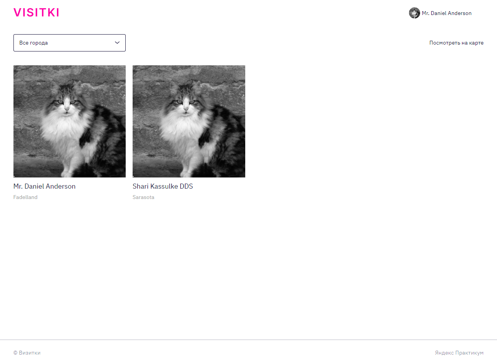

# Проект платформы-визитницы VISITKI

## О проекте
Visitki - своеобразная внутренняя социальная сеть для студентов Яндекс.Практикум. Проект содержит личные страницы студентов, кураторов и наставников. Платформа позволяет учащимся лучше узнать друг друга, так как каждый пользователь может указать:
* Любимую цитату
* Местоположение
* Интересы, хобби, сферу работы и многое другое!
У студентов так же есть возможность оставлять комментарии под каждой "визиткой".

№Страница авторизации
* Пользователь авторизуется через Яндекс ID

___

#Главная страница
* Главная страница для студента с отображением его однокурсников, так же к данной странице каждой из групп имеет доступ администратор.

___

№Страница детальной информации профиля

___

№Страница редактирования профиля

___

* React-Router
   - Регистрация
   - Авторизация и обновление токена
   - Выход из системы
   - Куки
   - Получение и обновление информации о пользователе
   - Защищённые маршруты в приложении


___
## Использованные технологии
* HTML
* CSS
* Адаптивная, кроссбраузерная верстка с использованием Flexbox и Grid Layout
* Авторизация с помощью Яндекс ID 
* Работа с картами и подсказками городов при помощи API Яндекс.Карт 
* React - JSX (модульный подход с использованием import, export)
* Hooks
* Redux
* Ref
* React Router v6.7
* TypeScript
* Установка заготовенного CRA - npx create-react-app react-burger --template typescript 
* Организована файловая структура: 
  - Каждый компонент хранится в отдельной директории
  - Для стилизации компонентов используются CSS-модули
  - Директории и файлы компонентов в нотации CamelCase

___
## Макет

[Ссылка на макет проекта](https://www.figma.com/file/nKBudPP12bvNm15W486Y9R/WEB_RUS_STUD_soft_skills?t=bKfp4S1GRIKJ6k4g-6)

___
## Локальная установка и запуск
```
Клонировать репозиторий
  git clone https://github.com/EukleidesRUS/Visitki.git

Войти в проект через консоль
  cd Visitki

Установить зависимости
  npm install

Старт сервера
  npm start
```
